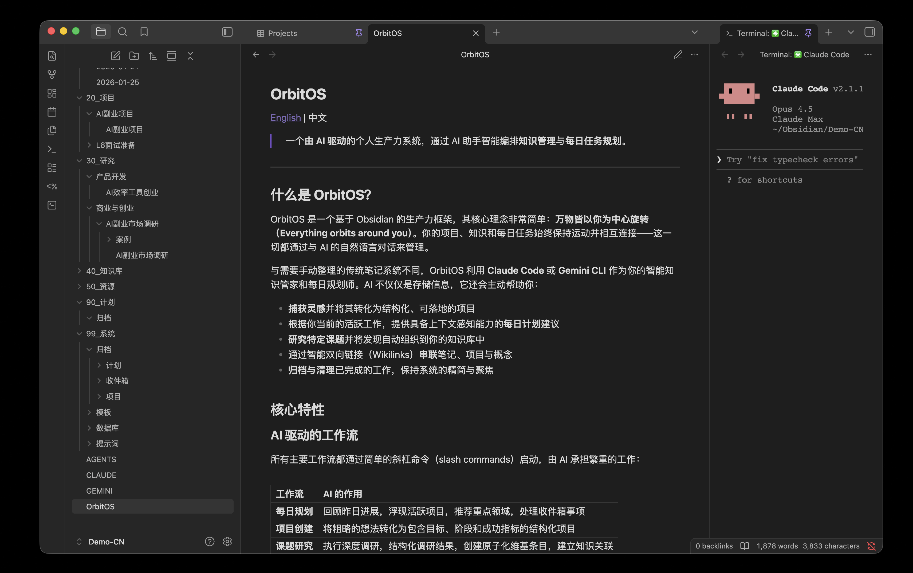

# obsidian-iflow 2.0

[English](README.md) | 中文

> 一个 **iFlow 驱动**的个人生产力系统——让 AI 助手帮你打理**知识管理**和**每日规划**。

> 本项目参考了 [OrbitOS](https://github.com/MarsWang42/OrbitOS) 的设计理念。



## 🌟 2.0 版本重大更新

obsidian-iflow 2.0 已全面迁移至 **iFlow**，提供更强大、更灵活的 AI 驱动工作流：

✅ **原生 iflow 支持** - 所有技能专为 iFlow 优化
✅ **完全本地化** - 所有界面和文档均为中文
✅ **增强的工作流** - 6 个核心技能，覆盖从想法到归档的完整流程
✅ **智能自动化** - 自动链接、分类、归档，最小化手动操作
✅ **模块化设计** - 技能可独立使用，也可组合工作

## 📦 安装

### 前提条件

1. **安装 Obsidian** - [下载地址](https://obsidian.md/download)（支持 macOS、Windows、Linux）
2. **安装 iFlow CLI** - 按照 iFlow 官方文档安装
3. **克隆或下载 obsidian-iflow**

### 方式一：Git Clone

```bash
git clone https://github.com/ah0210/obsidian-iflow.git my-vault
cd my-vault
```

### 方式二：直接下载

1. 访问 [GitHub Releases](https://github.com/ah0210/obsidian-iflow/releases)
2. 下载最新版本的 ZIP 文件
3. 解压到你的 Obsidian 库目录

### 配置 iFlow

在 obsidian-iflow 根目录下，确保 `iflow.config.json` 文件存在且配置正确。

## 🎯 什么是 obsidian-iflow？

obsidian-iflow 是一个基于 Obsidian 的生产力框架，核心理念很简单：**你是中心，万物围绕你运转**。项目、知识、日常任务如同行星一般环环相扣、持续演进——而管理这一切，只需用自然语言和 AI 聊聊天。

### 核心特性

#### AI 驱动的工作流

主要工作流都通过简单的命令启动，繁重的活儿交给 iFlow：

| 技能 | 功能 | 适用场景 |
| :--- | :--- | :--- |
| **start-my-day** | 每日规划与回顾 | 每天早上，明确今日重点 |
| **kickoff** | 想法转项目 | 启动任何新计划 |
| **ask** | 快速问答 | 简单问题、查个事实 |
| **parse-knowledge** | 知识解析 | 处理笔记、文章、会议记录 |
| **research** | 深入研究 | 系统性地学习一个领域 |
| **archive** | 归档处理 | 定期维护、项目收尾 |

#### 智能知识图谱

obsidian-iflow 大量使用双向链接，构建相互连通的知识网络：

- **项目**链接到相关的**研究笔记**，随时查阅背景资料
- **每日笔记**链接到当天推进的项目
- **知识库条目**是原子化的概念，可以在任何地方被引用
- **研究笔记**汇总信息，并链接回源头概念

AI 会在你工作的过程中自动建立这些连接，日积月累，知识网络越织越密。

#### 结构清晰，灵活可变

文件夹结构一目了然，同时保持足够的灵活性：

```
├── 00_收件箱/         # 快速捕获 → 使用 /kickoff 或 /parse-knowledge 处理
├── 10_日记/           # 每日日志 (YYYY-MM-DD.md) → 使用 /start-my-day 生成
├── 20_项目/           # 活跃项目 → 使用 /kickoff 创建
├── 30_研究/           # 深度研究笔记 → 使用 /research 生成
├── 40_知识库/         # 原子概念 → 从研究中提取
├── 50_资源/           # 精选内容 → 邮报、产品发布、参考资料
├── 90_计划/           # 执行方案 → 起草后归档
└── 99_系统/           # 系统配置
    ├── 归档/          # 历史记录 (按年/月组织)
    ├── 模板/          # 保持一致性的 Markdown 模板
    └── 技能/          # iFlow 技能定义
```

## 🚀 快速入门

### 第一天怎么用

#### 1. 随手记下第一个想法

往 `00_收件箱/` 里扔一条笔记，写什么都行——灵感、项目点子、想研究的东西。不用管格式，iFlow 稍后会帮你整理。

#### 2. 开始新的一天

在 iFlow 中运行 `/start-my-day`：

```bash
iflow start-my-day
```

iFlow 会：
- 扫描收件箱，把待处理的事项列出来
- 回顾进行中的项目
- 生成一份带建议的每日笔记

#### 3. 启动一个项目

运行 `/kickoff`，把收件箱里的想法变成正式项目：

```bash
iflow kickoff 00_收件箱/MyIdea.md
```

或者直接输入想法：

```bash
iflow kickoff 构建一个习惯追踪应用
```

iFlow 会：
- 起草项目计划
- 询问你一些细节问题
- 生成结构完整的项目文档

#### 4. 研究一个话题

运行 `/research` 深入调研：

```bash
iflow research 量子计算的应用
```

iFlow 会：
- 深度调研主题
- 在 `30_研究/` 创建结构化笔记
- 把核心概念提取到 `40_知识库/`
- 自动把所有内容链接起来

#### 5. 快速提问

运行 `/ask` 直接获取答案：

```bash
iflow ask 什么是番茄工作法？
```

iFlow 会：
- 直接给出答案
- 链接到相关笔记
- 询问是否要保存到知识库

## 📖 技能详解

### start-my-day - 每日规划

**功能：** 回顾昨天进展，规划今日任务，连接活跃项目

**工作流程：**
1. 读取昨天的每日笔记，提取未完成任务
2. 查找活跃项目和待处理收件箱项
3. 询问用户今日目标、新想法、阻碍
4. 创建今日每日笔记，填充待办事项和备注
5. 处理新想法，创建收件箱项
6. 展示今日规划摘要

**输出：**
- 更新的每日笔记 `10_日记/YYYY-MM-DD.md`
- 新的收件箱项（如有）
- 每日规划摘要

### kickoff - 项目启动

**功能：** 将想法或收件箱笔记转换为结构化项目

**工作流程：**
1. 读取输入（文件路径或内联文本）
2. 搜索相关笔记和领域
3. 询问用户项目详细信息（目标、规模、领域、优先级、截止日期）
4. 创建项目笔记，使用 C.A.P. 结构
5. 链接到今日笔记
6. 归档原始收件箱项（如适用）

**输出：**
- 项目笔记 `20_项目/<ProjectName>.md`
- 更新的今日笔记
- 归档的收件箱项（如适用）
- 项目创建摘要

### ask - 快速问答

**功能：** 快速获取答案，不创建笔记

**工作流程：**
1. 接收用户问题
2. 搜索知识库和相关笔记
3. 提供清晰、简洁的答案
4. 链接到相关笔记
5. 询问是否要保存到知识库或收件箱

**输出：**
- 问题答案
- 相关笔记链接
- 可选的知识库或收件箱项

### parse-knowledge - 知识解析

**功能：** 将零散文本整理到知识库

**工作流程：**
1. 接收输入（文件路径或内联文本）
2. 分析内容，提取关键信息
3. 识别内容类型（概念、研究、实践、资源）
4. 询问用户处理方式
5. 创建或更新相应笔记
6. 建立链接

**输出：**
- 知识库笔记 `40_知识库/<概念>.md`（如适用）
- 研究笔记 `30_研究/<标题>.md`（如适用）
- 收件箱项 `00_收件箱/<标题>.md`（如适用）
- 更新的现有笔记（如适用）

### research - 深入研究

**功能：** 对特定主题进行深度调研

**工作流程：**
1. 确定研究主题
2. 制定研究计划
3. 收集信息（内部知识 + 外部搜索）
4. 创建研究笔记，结构化内容
5. 提取核心概念，创建知识库笔记
6. 更新相关笔记

**输出：**
- 研究笔记 `30_研究/<主题>.md`
- 知识库笔记（多个）`40_知识库/<概念>.md`
- 更新的相关笔记

### archive - 归档处理

**功能：** 清理已完成的内容

**工作流程：**
1. 扫描待归档内容（收件箱、项目、每日笔记、计划）
2. 分类待归档项
3. 询问用户确认
4. 执行归档操作
5. 更新项目状态
6. 展示归档摘要

**输出：**
- 归档的收件箱项 `99_系统/归档/收件箱/YYYY/MM/`
- 归档的项目 `99_系统/归档/项目/YYYY/`
- 归档的每日笔记 `99_系统/归档/日记/YYYY/MM/`
- 归档的计划 `99_系统/归档/计划/`
- 更新的项目状态
- 归档摘要

## 🎨 设计哲学

obsidian-iflow 基于这些原则：

1. **AI 是伙伴** - AI 不只是工具，而是理解你的系统、帮你维护它的协作者
2. **先记下来，再整理** - 收件箱让你永不丢失灵感；准备好了再让 AI 帮你处理
3. **连接比分类重要** - 死板的文件夹层级迟早崩溃；双向链接构建灵活可查的知识图谱
4. **每日节奏** - 每日笔记锚定一切，为工作和思考建立时间线
5. **渐进式结构化** - 想法从粗糙开始，在 AI 辅助下逐步变得清晰有序

## 📚 项目结构

### C.A.P. 项目结构

每个项目都遵循统一格式：

- **Context（背景）**：要做什么？怎样算成功？
- **Actions（行动）**：分阶段的任务清单
- **Progress（进展）**：带时间戳的更新，链接到每日笔记

### 双向链接

obsidian-iflow 重度使用 Obsidian 的双向链接语法：

```markdown
[[笔记名称]]                # 基础链接
[[笔记名称|显示文本]]       # 自定义显示文本
![[笔记名称]]               # 嵌入整篇笔记
![[笔记名称#章节]]          # 嵌入特定章节
```

### 每日笔记是锚点

每日笔记 (`10_日记/YYYY-MM-DD.md`) 是整个系统的锚点：

- 每次项目更新都会引用当天的每日笔记
- 收件箱事项处理后，从每日笔记链接出去
- `/start-my-day` 会自动生成每日笔记

## 🔧 技术细节

### iflow 配置

obsidian-iflow 使用 `iflow.config.json` 配置文件定义：

- 技能目录和模板目录
- 文件夹路径映射
- 默认设置（日期格式、自动链接等）

### 模板系统

所有笔记都使用统一的模板：

- `Daily_Note.md` - 每日笔记模板
- `Project_Template.md` - 项目笔记模板
- `Inbox_Template.md` - 收件箱模板
- `Wiki_Template.md` - 知识库模板
- `Content_Template.md` - 研究笔记模板

### Frontmatter 格式

所有笔记都使用 YAML frontmatter：

```yaml
---
title: "标题"
type: 类型
created: YYYY-MM-DD
status: 状态
tags: [标签]
---
```

## 🤝 贡献

欢迎贡献！请遵循以下步骤：

1. Fork 本仓库
2. 创建特性分支 (`git checkout -b feature/AmazingFeature`)
3. 提交更改 (`git commit -m 'Add some AmazingFeature'`)
4. 推送到分支 (`git push origin feature/AmazingFeature`)
5. 开启 Pull Request

## 📄 开源协议

MIT License — 随便用，随便改，欢迎分享。

## 🙏 致谢

- **iFlow** - 强大的 AI CLI 工具
- **Obsidian** - 优秀的知识管理工具
- **PARA 方法** - 项目、领域、资源、归档的组织理念
- **Zettelkasten** - 永久笔记的灵感来源

## 📞 支持

如果你有任何问题或建议：

- 提交 [Issue](https://github.com/ah0210/obsidian-iflow/issues)
- 查看 [Wiki](https://github.com/ah0210/obsidian-iflow/wiki)
- 加入 [Discussions](https://github.com/ah0210/obsidian-iflow/discussions)

---

**让 AI 帮你打理一切，专注于真正重要的事情。**

## 📝 原项目参考

本项目基于 [OrbitOS](https://github.com/MarsWang42/OrbitOS) 的设计理念进行开发。